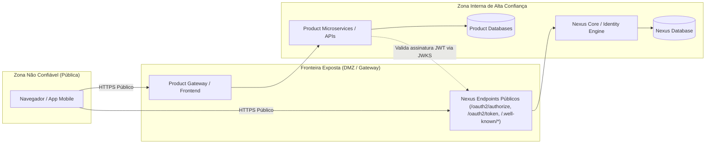

# Arquitetura — Fronteiras e Limites de Responsabilidade

Este documento detalha os limites operacionais e conceituais entre o **Nexus** e as aplicações/produtos consumidores, prevenindo acoplamentos nocivos e delimitando fronteiras de confiança.

---

## 1. Matriz de Responsabilidades

| Responsabilidade | Nexus (IdP) | Produto Consumidor |
| :--- | :---: | :---: |
| Cadastro e ciclo de vida de credenciais (senhas) | Sim | Não |
| Desafios de autenticação primária (Login) | Sim | Não |
| Gestão de Multi-Factor Authentication (MFA) | Sim | Não |
| Emissão e assinatura de ID Tokens e Access Tokens | Sim | Não |
| Validação de assinatura de tokens JWT recebidos | Não | Sim (via JWKS do Nexus) |
| Gestão de sessão de SSO no navegador | Sim | Não |
| Gestão de sessão local de aplicação / estado HTTP | Não | Sim |
| Verificação de e-mail e recuperação de senha | Sim | Não |
| Gestão de permissões de negócio (ex: 'ADMIN', 'GERENTE') | Não | Sim |
| Lógica de negócio de domínios específicos | Não | Sim |
| Armazenamento de dados transacionais do usuário | Não | Sim |
| Mapeamento de `sub` para o perfil interno do produto | Não | Sim |

---

## 2. Fronteiras de Confiança (Trust Boundaries)

### Regras das Fronteiras:
1. **Nexus não confia no cliente**: Todo cliente público (Single Page Application, Mobile) deve utilizar obrigatoriamente **PKCE** (Proof Key for Code Exchange).
2. **Produtos não confiam cegamente em parâmetros**: Um produto consumidor nunca deve aceitar dados de identidade que não venham de um token assinado e criptograficamente verificado contra o Nexus.
3. **Isolamento de persistência**: O Nexus possui sua própria base de dados e nunca deve compartilhar conexão JDBC ou tabelas com os bancos de dados dos produtos consumidores.

---

## 3. Anti-Padrões a Evitar Rigorosamente

### ❌ Anti-Padrão 1: "O Nexus como Banco Central de Permissões de Domínio"
*Exemplo incorreto*: Adicionar ao Nexus colunas como `is_product_a_admin`, `product_b_subscription_status`.
*Por que é ruim*: Quebra o princípio de desacoplamento. Cada alteração de regra de negócio em um produto exigiria migração e deploy do Nexus.
*Forma correta*: O Nexus emite um token contendo apenas identidade (`sub`, `email`). O Produto A consulta sua própria tabela local de permissões usando o `sub`.

### ❌ Anti-Padrão 2: "Autenticação por Delegação / Proxied Password"
*Exemplo incorreto*: O Produto A cria um formulário próprio de login, recebe a senha em texto claro do usuário e envia via POST para o Nexus autenticar.
*Por que é ruim*: Aumenta dramaticamente a superfície de ataque; o Produto A passa a ter contato com credenciais sensíveis que deveriam ser isoladas.
*Forma correta*: O usuário é redirecionado via navegador para a página de autenticação hospedada no Nexus (Authorization Code Flow).

### ❌ Anti-Padrão 3: "Acoplamento de Dependências de Código"
*Exemplo incorreto*: O repositório do Nexus adicionar dependências de bibliotecas de domínio do Produto A (ex: `import com.empresa.produtoa.dto.*`).
*Por que é ruim*: Inversão inaceitável de dependência.
*Forma correta*: A interface de integração é 100% baseada em protocolos HTTP padrão (OAuth 2.0 / OpenID Connect).
