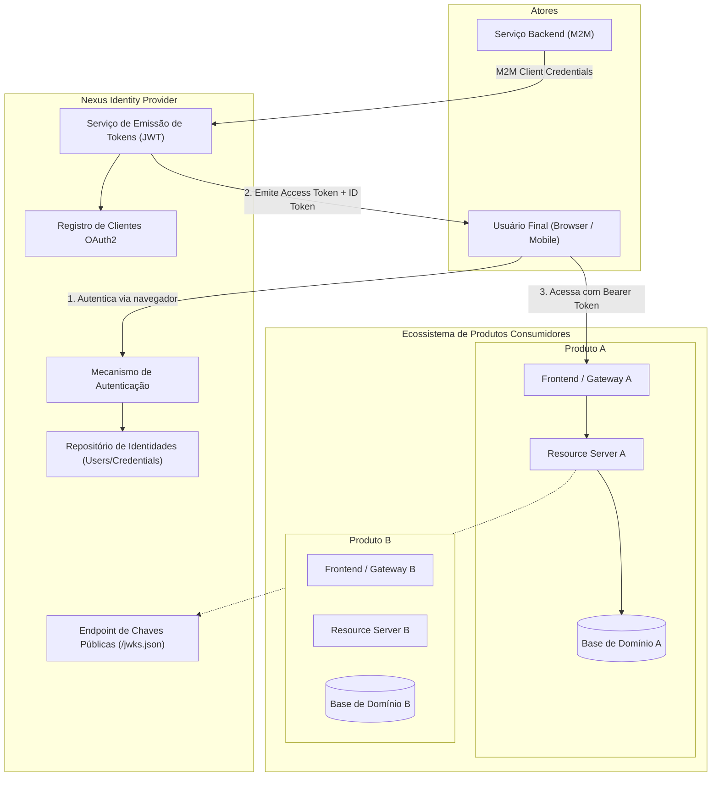

# Arquitetura — Visão Geral

Este documento apresenta a arquitetura macro do **Nexus**, detalhando seu papel como Identity Provider (IdP) centralizado, a topologia de comunicação com clientes e recursos, e a organização funcional pretendida.

---

## 1. Visão do Sistema

O Nexus atua como autoridade central de autenticação e emissão de identidade para o ecossistema. Ele provê autenticação única (Single Sign-On - SSO), centralização de credenciais e gestão de consentimentos de identidade, enquanto delega aos produtos consumidores a responsabilidade integral por suas regras de negócio e autorizações internas.

---

## 2. Componentes Funcionais do Nexus

| Componente | Função | Status Atual |
| :--- | :--- | :--- |
| **Authn Engine** | Gerencia desafios de autenticação (usuário/senha, verificação de credenciais). | `[Planejado]` *(Spring Security starter presente)* |
| **Token Service** | Emissão, assinatura e rotação de tokens (Access Tokens, ID Tokens, Refresh Tokens). | `[Decisão Adotada]` *(Framework de autorização sob definição)* |
| **Identity Store** | Armazenamento de identidades globais, credenciais hasheadas e estados de conta. | `[Planejado]` *(Spring Data JPA e driver PostgreSQL presentes)* |
| **Client Registry** | Catálogo de aplicações autorizadas, com `client_id`, segredos e `redirect_uris`. | `[Decisão Adotada]` |
| **JWKS Endpoint** | Exposição pública das chaves assimétricas de verificação de assinatura (`/.well-known/jwks.json`). | `[Decisão Adotada]` |
| **Session Manager** | Manutenção da sessão autenticada do usuário na camada do IdP para SSO. | `[Decisão Adotada]` |

---

## 3. Estado Atual da Base de Código

A inspeção da base revela que o projeto encontra-se em estágio inicial de **bootstrap tecnológico**:

- **Linguagem & Runtime**: Java 21 (`[Implementado]`)
- **Framework Base**: Spring Boot 4.1.1 (`[Implementado]`)
- **Camada Web**: `spring-boot-starter-webmvc` (Padrão Servlet síncrono) (`[Implementado]`)
- **Camada de Persistência**: `spring-boot-starter-data-jpa` configurado (`[Implementado]`), porém sem entidades de domínio criadas.
- **Camada de Segurança**: `spring-boot-starter-security` incluído (`[Implementado]`), utilizando o filtro de segurança padrão do Spring Boot.
- **Driver de Banco**: `org.postgresql:postgresql` no escopo `runtime` (`[Implementado]`), mas sem configuração de conexão ativa em `application.properties`.
- **Servidor de Autorização**: O pacote de servidor de autorização OAuth 2.0 (ex: `spring-security-oauth2-authorization-server`) ainda não está adicionado ao `pom.xml` (`[Questão Aberta]`).

---

## 4. Próximos Passos de Arquitetura

1. Formalizar a adoção do **Spring Authorization Server** para fornecer os endpoints OAuth2 e OIDC padrão.
2. Definir o esquema relacional mínimo para usuários e credenciais em [`identity/identity-model.md`](../identity/identity-model.md).
3. Configurar a ferramenta de migração de banco de dados (Flyway ou Liquibase).
4. Implementar isolamento das chaves de assinatura criptográfica (JWK).
