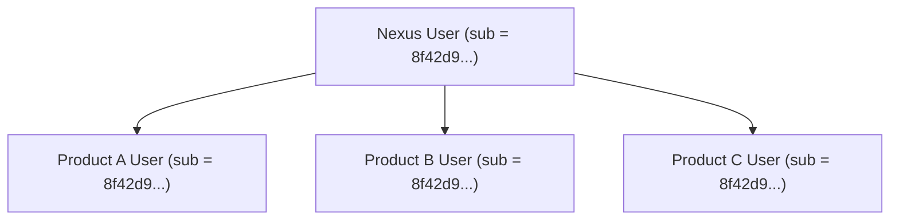

# Arquitetura — Princípios Fundamentais

Este documento estabelece os princípios arquiteturais não negociáveis que regem o design, o desenvolvimento e a evolução do **Nexus**. Qualquer decisão técnica deve ser compatível com esses princípios.

---

## 1. Identity Provider Desacoplado

O Nexus é uma autoridade de identidade independente e não deve ser subordinado a nenhum produto consumidor específico.

### O que o Nexus CONHECE:
- Identidades centrais (usuários, status da conta, e-mail verificado).
- Credenciais e métodos de autenticação (senhas hasheadas, desafios futuros).
- Clientes OAuth 2.0 / OIDC registrados e suas configurações de redirecionamento.
- Sessões ativas de Single Sign-On (SSO) na camada do IdP.
- Consentimentos outorgados pelo usuário.
- Escopos e claims relacionados à identidade (`sub`, `email`, `profile`).
- Emissão, assinatura, rotação e revogação de tokens.

### O que o Nexus NÃO CONHECE:
- Regras de negócio internas de produtos consumidores (pedidos, assinaturas, carrinhos, relatórios).
- Entidades específicas de domínio de produtos externos.
- Permissões internas específicas de produtos (ex: "pode editar página 10", "gestor financeiro do tenant B").
- Hierarquias organizacionais ou papéis operacionais próprios de um produto específico.

---

## 2. Uma Identidade para Múltiplos Produtos

A existência do Nexus elimina a necessidade de cada produto implementar seu próprio banco de credenciais ou fluxo de login:

- Um usuário autentica-se **uma única vez** no Nexus e pode acessar qualquer produto do ecossistema para o qual possua autorização ou acesso liberado.
- Mudanças cadastrais de identidade básica (e-mail, redefinição de senha) ocorrem de maneira centralizada no Nexus.

---

## 3. Separação Estrita entre Identidade e Domínio

A identidade global do Nexus é vinculada aos produtos consumidores exclusivamente por meio de um identificador público imutável (`sub` - Subject Identifier):

- O produto consumidor mantém sua própria tabela ou base local de usuários contendo apenas:
  - O identificador referencial do Nexus (`nexus_user_id` / `sub`);
  - As preferências e permissões de negócio locais do produto.
- **Invariante**: Se o Produto A precisar adicionar um campo comercial (ex: "limite de crédito"), esse campo **nunca** deve ser adicionado ao banco de dados do Nexus. Ele pertence exclusivamente ao domínio do Produto A.

---

## 4. Adoção Estrita de Protocolos Padrão

O Nexus apoia-se em especificações abertas da indústria:

- **OAuth 2.0 (RFC 6749, RFC 7636, RFC 8252)**: Para autorização e concessão de acesso a recursos.
- **OpenID Connect Core 1.0**: Para verificação de identidade e emissão de ID Tokens padronizados.
- **JSON Web Token (JWT / RFC 7519)** e **JWKS (RFC 7517)**: Para tokens assinados criptograficamente e distribuição de chaves públicas.

> [!IMPORTANT]
> É expressamente proibido conceber esquemas proprietários de criptografia, cabeçalhos de token não convencionais ou fluxos de autenticação caseiros que desviem dos padrões estabelecidos.

---

## 5. Segurança como Requisito Estrutural

O Nexus não trata a segurança como uma funcionalidade posterior ("add-on"), mas como fundação de todo o código:

1. **Defesa em Profundidade**: Nenhum componente depende exclusivamente de uma única barreira de proteção.
2. **Princípio do Privilégio Mínimo**: Clientes e usuários recebem estritamente os escopos e tokens necessários para sua função.
3. **Padrões Seguros por Definição (Secure Defaults)**:
   - Tokens com tempo de vida curto por padrão.
   - Headers de segurança obrigatórios (HSTS, CSP, X-Content-Type-Options).
   - Cookies de sessão obrigatoriamente protegidos (`HttpOnly`, `Secure`, `SameSite=Strict` ou `Lax`).
   - Obrigatoriedade de PKCE para fluxos de Authorization Code.
4. **Resistência a Vazamentos**: Zero secrets no código-fonte e sanitização estrita de logs de aplicação.
