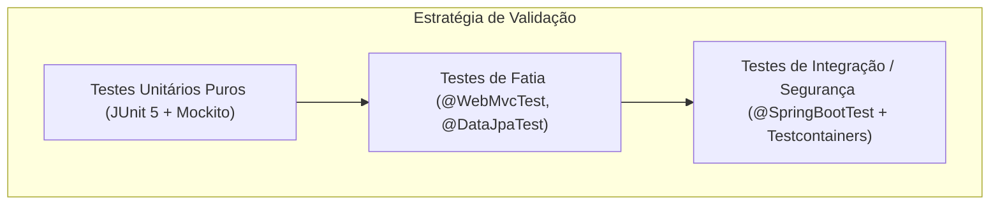

# Desenvolvimento — Estratégia de Testes

Este documento estabelece as diretrizes de qualidade, a pirâmide de testes e os padrões de validação automatizada para o **Nexus**.

---

## 1. Estado Atual da Suíte de Testes

A inspeção do repositório revela a presença inicial de:
- Classe de teste: [`src/test/java/io/github/theprogmatheus/nexus/NexusApplicationTests.java`](file:///C:/Users/matheus.ferreira/Documents/Nexus/src/test/java/io/github/theprogmatheus/nexus/NexusApplicationTests.java) com o método `contextLoads()`.
- **Dependências de teste modulares no `pom.xml`**:
  - `spring-boot-starter-data-jpa-test`: Slice tests para persistência JPA.
  - `spring-boot-starter-security-test`: Utilitários para teste de autenticação, filtros e MockMvc de segurança.
  - `spring-boot-starter-webmvc-test`: Slice tests para controladores HTTP Web MVC.

---

## 2. Pirâmide e Níveis de Testes

### 2.1. Testes Unitários Puros
- **Foco**: Lógica de regras de domínio puras, validação de tokens, serialização de claims e utilitários de hashing.
- **Velocidade**: Milissegundos; sem inicialização do Spring ApplicationContext.
- **Ferramentas**: JUnit 5, AssertJ, Mockito.

### 2.2. Testes de Fatia (Slice Tests)
- **`@WebMvcTest`**: Valida rotas de controladores, respostas HTTP, validação de beans (`@Valid`) e serialização JSON.
- **`@DataJpaTest`**: Valida consultas de repositório, mapeamentos de entidades e restrições de integridade referencial.

### 2.3. Testes de Integração e Segurança
- **Foco**: Fluxos completos de autenticação (OAuth2 Authorization Code com PKCE, emissão e revogação de tokens).
- **Banco de Dados**: Recomenda-se o uso futuro de **Testcontainers com PostgreSQL** para garantir paridade exata com o ambiente de produção, evitando discrepâncias de dialeto entre H2 e PostgreSQL.

---

## 3. Diretrizes para Testes de Segurança

Por ser um Identity Provider, os seguintes cenários devem ter cobertura mandatória:

1. **Tentativas Inválidas de Autenticação**:
   - Garantir que senhas erradas resultam em `401 Unauthorized`.
   - Garantir que usuários bloqueados não conseguem autenticar.
2. **Validação de PKCE**:
   - Garantir que requisições de troca de código sem `code_verifier` sejam rejeitadas.
   - Garantir que `code_verifier` incorreto resulte em erro `invalid_grant`.
3. **Validação de Redirecionamento**:
   - Garantir que `redirect_uri` não cadastrada seja sumariamente bloqueada antes da exibição da tela de login.
4. **Proteção contra CSRF**:
   - Testar se requisições POST em formulários de login sem token CSRF válido são rejeitadas com `403 Forbidden`.
