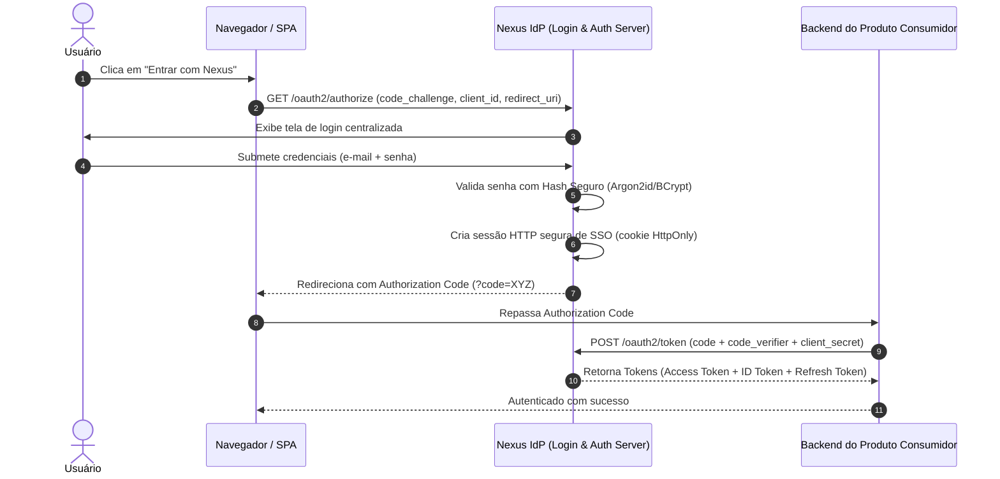

# Identidade — Autenticação e Credenciais

Este documento define os mecanismos de autenticação de usuários, o ciclo de vida de credenciais, as políticas de segurança contra ataques de força bruta e os fluxos de login no **Nexus**.

---

## 1. Fluxos de Autenticação Suportados e Planejados

### Status dos Fluxos:
- **Authorization Code Flow com PKCE**: `[Decisão Adotada]` (Obrigatório para clientes públicos e confidenciais; implementação pendente).
- **Client Credentials Flow**: `[Decisão Adotada]` (Para comunicação máquina-para-máquina entre serviços).
- **Resource Owner Password Credentials (ROPC)**: `[Proibido]` (Depreciado no OAuth 2.1 devido ao risco de exposição de credenciais ao cliente).
- **Implicit Flow**: `[Proibido]` (Depreciado no OAuth 2.1 devido ao vazamento de tokens em fragmentos de URL).

---

## 2. Armazenamento e Verificação de Senhas

### Requisitos Estruturais
1. **Nunca armazenar senhas em texto claro** sob nenhuma hipótese.
2. **Algoritmo de Hashing Criptográfico**:
   - *Status*: `[Questão Aberta]` entre **Argon2id** (vencedor da Password Hashing Competition, resistente a GPU/ASIC) e **BCrypt** (padrão histórico do Spring Security).
   - *Recomendação*: **Argon2id** (`Argon2PasswordEncoder` do Spring Security) com parâmetros configuráveis de memória, iterações e paralelismo.
3. **Salting**:
   - Cada senha deve ter um salt criptograficamente aleatório gerado individualmente (garantido nativamente pelos encoders do Spring Security).

---

## 3. Proteções contra Ataques de Autenticação

| Vetor de Ataque | Mecanismo de Defesa | Status |
| :--- | :--- | :---: |
| **Força Bruta / Credential Stuffing** | Rate Limiting em `/login` e `/oauth2/token` baseado em IP e conta. | `[Planejado]` |
| **Enumeração de Usuários** | Mensagens de erro opacas ("Credenciais inválidas") com tempo de resposta constante. | `[Requisito]` |
| **Adivinhação Automatizada** | Bloqueio temporário de conta (5 falhas consecutivas geram bloqueio de 15 minutos). | `[Planejado]` |
| **Session Fixation** | Invalidação e rotação de ID de sessão após login bem-sucedido. | `[Requisito]` |
| **Timing Attacks** | Comparações de hashes e tokens em tempo constante (`MessageDigest.isEqual`). | `[Requisito]` |

---

## 4. Recuperação de Conta e Redefinição de Senha

O fluxo de redefinição de senha deve atender aos seguintes critérios de segurança:

1. **Tokens de Recuperação**:
   - Gerados a partir de fonte segura de aleatoriedade (`SecureRandom` de no mínimo 256 bits).
   - Armazenados no banco apenas na forma de hash (SHA-256), impedindo uso indevido em caso de dump de banco.
   - Tempo de expiração curto (máximo de 15 a 30 minutos).
   - **Uso único**: O token deve ser invalidado imediatamente após o primeiro uso.
2. **Invalidação de Sessões Ativas**:
   - Ao alterar a senha com sucesso, todas as sessões e tokens de refresh do usuário devem ser imediatamente revogados.

---

## 5. Multi-Factor Authentication (MFA) `[Planejado]`

- **Fase 1 (MVP)**: Autenticação primária baseada em e-mail + senha com rate limiting estrito.
- **Fase 2 (Evolução)**:
  - TOTP (Time-based One-Time Password / RFC 6238) via aplicativos autenticadores (Google Authenticator, Bitwarden, 1Password).
  - Códigos de recuperação de emergência (backup recovery codes) com hashing unidirecional.
  - Suporte futuro a WebAuthn / Passkeys (FIDO2).
