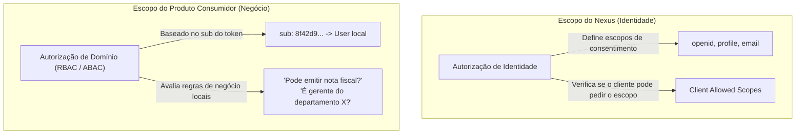

# Identidade — Autorização e Escopos

Este documento formaliza a separação conceitual entre **Autorização de Identidade (Nexus)** e **Autorização de Domínio de Negócio (Produtos Consumidores)**, estabelecendo as fronteiras dos escopos OAuth2.

---

## 1. Separação de Conceitos: Identidade vs Domínio

Um dos principais riscos em arquiteturas de autenticação centralizada é o vazamento de responsabilidades de negócio para dentro do IdP. O Nexus estabelece uma distinção rigorosa:

### Regra de Ouro da Autorização:
> **O Nexus autoriza o que o cliente pode saber sobre a identidade do usuário.**
> **O Produto autoriza o que o usuário pode fazer dentro do seu próprio sistema.**

---

## 2. Escopos de Identidade no Nexus

Os escopos emitidos pelo Nexus pertencem ao domínio OpenID Connect e acesso a recursos de identidade:

| Escopo | Descrição | Dados Liberados |
| :--- | :--- | :--- |
| `openid` | **Obrigatório para OIDC**. Sinaliza requisição de identidade. | Emite ID Token com o claim `sub`. |
| `profile` | Acesso aos dados básicos de perfil. | `name`, `preferred_username`, `updated_at`. |
| `email` | Acesso ao endereço de e-mail do usuário. | `email`, `email_verified`. |
| `offline_access` | Solicitação de autorização de longo prazo. | Emite `refresh_token`. |

---

## 3. Papéis (Roles) Globais vs Papéis de Domínio

### O que o Nexus PODE Conter (Papéis Administrativos do IdP):
O Nexus apenas possui papéis relacionados à **administração da própria plataforma Nexus**:
- `NEXUS_ADMIN`: Administrador que pode cadastrar clientes OAuth2, revogar tokens ou bloquear contas globalmente.
- `NEXUS_OPERATOR`: Operador de suporte com permissão de leitura de auditoria.

### O que o Nexus NUNCA Deve Conter:
- Papéis como `FINANCIAL_DIRECTOR`, `STORE_MANAGER`, `PRODUCT_A_USER`.
- Permissões granulares de produtos como `reports:write`, `invoices:delete`.

Se um produto necessitar de autorização granular, essa checagem deve residir:
1. No próprio banco relacional do produto, indexado pela chave `sub` do Nexus.
2. Em um PDP (Policy Decision Point) de autorização distribuído (ex: Open Policy Agent - OPA), totalmente separado do Nexus.

---

## 4. Invariantes de Autorização

1. **Nexus não aceita escopos desconhecidos**: Clientes só podem solicitar escopos pré-registrados em seu cadastro de cliente (`ClientRegistration`).
2. **Consentimento Explícito `[Planejado]`**: O usuário deve consentir explicitamente caso uma aplicação de terceiros solicite acesso aos escopos `email` ou `profile`.
3. **Escopos não substituem permissões**: Ter o escopo `openid` em um Access Token confere ao portador apenas a capacidade de provar quem é o usuário, e não a autorização para executar operações restritas nos microsserviços de produtos.
