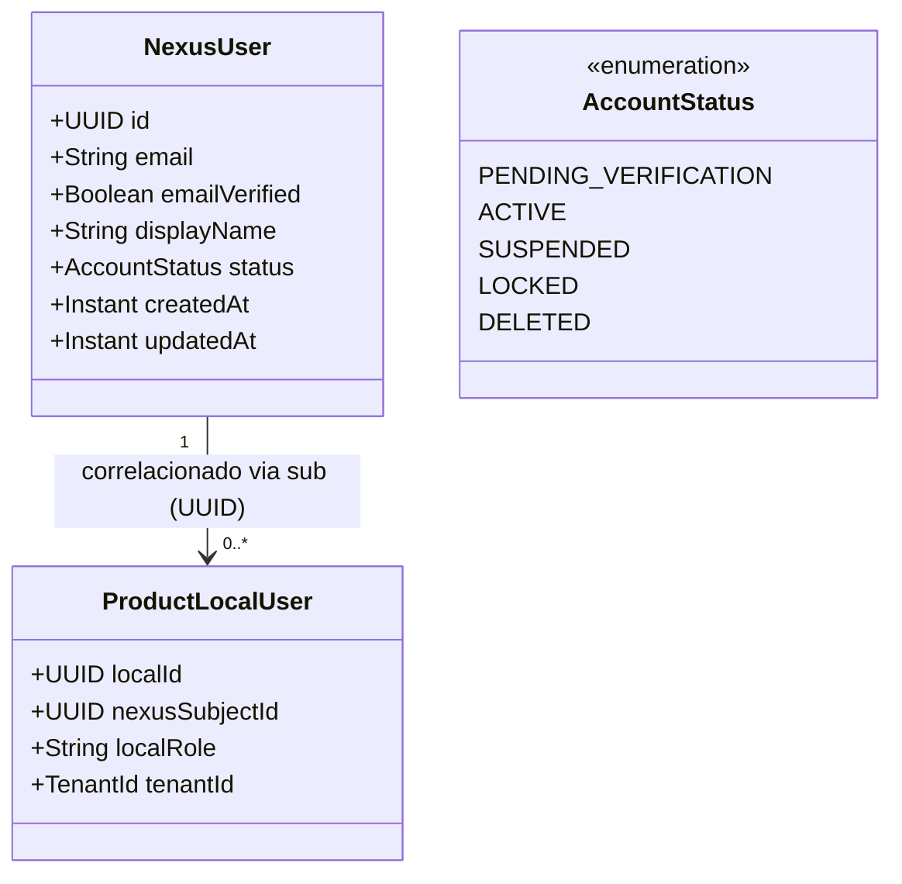
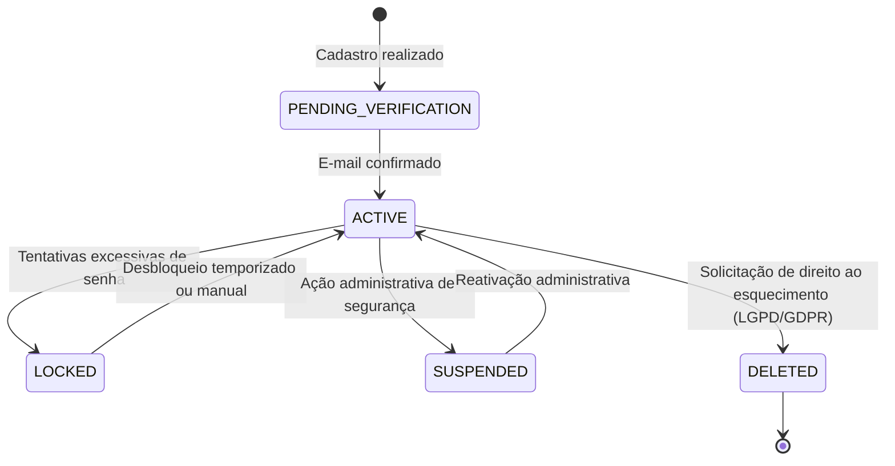

# Identidade — Modelo de Identidade

Este documento define o conceito de entidade de identidade do **Nexus**, seus atributos essenciais, seu ciclo de vida e a forma como se correlaciona com os usuários locais dos produtos consumidores.

---

## 1. O Conceito de "Nexus User"

O Nexus User representa a entidade canônica de um ser humano ou agente no ecossistema. Ele é o proprietário de credenciais e o sujeito (`sub`) das asserções de identidade emitidas via OIDC.



---

## 2. Atributos da Identidade Central

| Atributo | Tipo | Descrição | Restrição |
| :--- | :--- | :--- | :--- |
| `id` / `sub` | UUID v4 | Identificador global imutável do usuário. | Chave primária, imutável, único. |
| `email` | String | Endereço principal de e-mail e chave de login. | Único, normalizado (lowercase), indexado. |
| `email_verified` | Boolean | Indica se o e-mail passou por validação via link/código. | Obrigatório para emissão de certos escopos. |
| `display_name` | String | Nome de exibição público ou preferencial do usuário. | Sanitizado contra XSS. |
| `status` | Enum | Estado operacional da conta (ativo, bloqueado, etc.). | Controla autorização de login. |
| `created_at` | Instant | Timestamp UTC de criação da identidade. | Imutável. |
| `updated_at` | Instant | Timestamp UTC da última atualização cadastral. | Atualizado via trigger/JPA. |

> [!NOTE]
> **Status de Implementação**: O modelo acima é uma `[Decisão Adotada]`. O repositório atual ainda não possui a classe `@Entity` Java implementada no pacote `io.github.theprogmatheus.nexus`.

---

## 3. Relação entre Identidade Global e Usuário Local do Produto

Cada produto consumidor mantém autonomia de domínio. A correlação ocorre **exclusivamente pelo identificador `sub`**:

1. **Provisionamento Just-in-Time (JIT)**:
   - Quando um usuário autentica-se com sucesso pela primeira vez no Produto A via Nexus, o Produto A recebe o ID Token contendo `sub: "9b1deb4d-3b7d-4bad-9bdd-2b0d7b3dcb6d"`.
   - Se o Produto A não tiver registro local desse `sub`, ele cria automaticamente um registro local na sua própria tabela de usuários:
     ```sql
     -- Exemplo de tabela interna no Produto A (FORA do Nexus)
     CREATE TABLE local_product_users (
         id BIGSERIAL PRIMARY KEY,
         nexus_subject UUID NOT NULL UNIQUE,
         assigned_role VARCHAR(50) NOT NULL,
         department VARCHAR(100)
     );
     ```
2. **Desacoplamento de Ciclo de Vida**:
   - Se o usuário atualizar seu nome ou senha no Nexus, os dados de identidade são atualizados centralmente.
   - Se o Produto A revogar a permissão local de um usuário para acessar um módulo financeiro interno, isso **não afeta** a identidade Nexus nem impede o usuário de usar o Produto B.

---

## 4. Estados de Conta (Account Lifecycle)



- **ACTIVE**: O usuário pode realizar login e solicitar autorizações.
- **LOCKED**: Bloqueio de proteção contra força bruta (temporizado).
- **SUSPENDED**: Bloqueio definitivo por fraude, investigação ou solicitação de suporte.
- **DELETED**: Registro anonimizado ou excluído de acordo com requisitos legais de proteção de dados.
