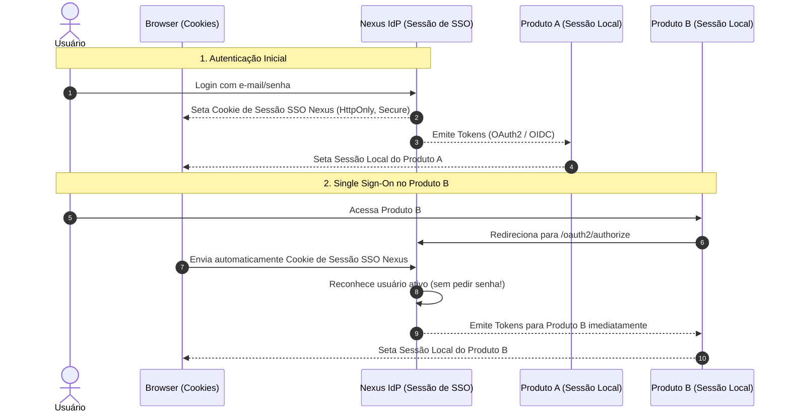

# Identidade — Gestão de Sessões e Logout

Este documento descreve o modelo de sessões do **Nexus**, a distinção entre a sessão de SSO do IdP e as sessões locais de aplicação, e as estratégias de logout federado.

---

## 1. Sessão de IdP (SSO) vs Sessão de Aplicação

A arquitetura do Nexus diferencia claramente dois tipos de sessão:

### Definições:
1. **Sessão SSO do Nexus**:
   - Reside no domínio do Nexus (ex: `auth.nexus.internal`).
   - Identificada por um cookie criptografado ou assinado (`HttpOnly`, `Secure`, `SameSite=Lax`).
   - Permite que o usuário acesse múltiplos produtos sem reinserir credenciais enquanto a sessão for válida.
2. **Sessão Local do Produto**:
   - Gerenciada de forma totalmente autônoma pelo Produto A ou B (pode ser via cookie de sessão próprio, ou consumo de Bearer Token stateless em SPAs).

---

## 2. Ciclo de Vida da Sessão do IdP

| Parâmetro | Valor Padrão Sugerido | Descrição |
| :--- | :--- | :--- |
| **Idle Timeout (Inatividade)** | 30 minutos | Tempo sem requisições interativas antes de expirar a sessão. |
| **Absolute Timeout (Vida Máxima)** | 8 a 12 horas | Tempo máximo de duração da sessão, independente de atividade contínua. |
| **Fixação de Sessão (Protection)** | Ativo | Renovação mandatória do session ID imediatamente após autenticação primária. |
| **Controle de Concorrência** | `[Questão Aberta]` | Permitir múltiplas sessões por usuário ou invalidar sessão anterior ao novo login. |

---

## 3. Protocolos de Logout

O logout em um ecossistema com múltiplos produtos é um desafio distribuído. São previstos os seguintes comportamentos:

### 3.1. Local Logout (Logout Apenas no Produto)
- O usuário clica em "Sair" dentro do Produto A.
- O Produto A descarta sua sessão local e os tokens que armazenava.
- A sessão global do Nexus **continua ativa** para outros produtos.

### 3.2. Single Logout (SLO / Global Logout) `[Decisão Adotada / Implementação Futura]`
- O usuário clica em "Sair de todos os sistemas" ou realiza logout explicitamente no Nexus.
- **RP-Initiated Logout (OpenID Connect RP-Initiated Logout 1.0)**:
  - O produto redireciona para `GET /connect/logout?id_token_hint=...&post_logout_redirect_uri=...`.
  - O Nexus destrói a sessão de SSO do usuário e revoga os refresh tokens associados.
- **Notificação aos Produtos**:
  - *Back-Channel Logout (OIDC Back-Channel Logout 1.0)*: O Nexus dispara chamadas HTTP POST diretas de servidor-para-servidor para os endpoints de logout registrados de cada produto ativo.
  - *Status*: `[Questão Aberta]` entre Back-Channel Logout e simples expiração natural de tokens curtos.
