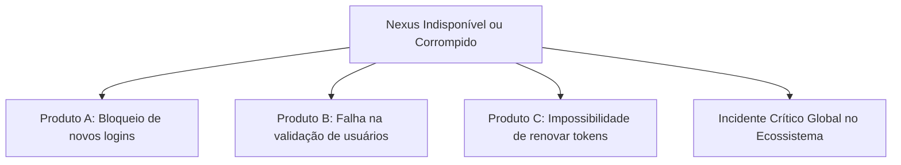

# Operações — Continuidade de Negócio e Recuperação de Desastres (Backup & Recovery)

Este documento estabelece as diretrizes de resiliência, planos de backup e estratégias de recuperação de desastres (Disaster Recovery) para o **Nexus**.

---

## 1. Criticidade Sistêmica do Identity Provider

Como autoridade central de autenticação para todos os produtos do ecossistema, uma indisponibilidade ou perda de dados no Nexus afeta a capacidade de login de **todos os produtos dependentes**:

---

## 2. Estratégia de Backup da Base de Identidades

### 2.1. Dados Persistidos no Banco Relacional (PostgreSQL)
- Identidades de usuários (`NexusUser`).
- Hashes de senhas e credenciais.
- Clientes OAuth2 registrados (`ClientRegistration`).
- Histórico de auditoria e consentimentos concedidos.

### 2.2. Políticas de Recuperação Recomendadas
- **Point-in-Time Recovery (PITR)**: Habilitação de arquivamento contínuo de WAL (Write-Ahead Logging) no PostgreSQL gerenciado.
- **RPO (Recovery Point Objective)**: Menor que 5 minutos em caso de corrupção de base.
- **RTO (Recovery Time Objective)**: Menor que 30 minutos para restabelecimento completo do serviço.
- **Snapshots Diários**: Backups automatizados armazenados em região geográfica secundária com criptografia em repouso.

---

## 3. Gestão e Resiliência de Chaves Criptográficas (JWK)

> [!IMPORTANT]
> A perda da chave privada de assinatura invalida a capacidade do Nexus de assinar novos tokens e quebra a validação de tokens existentes nos produtos consumidores.

1. **Backup Criptografado de Chaves**:
   - As chaves de assinatura devem ser armazenadas em serviço gerenciado de chaves (ex: AWS KMS, HashiCorp Vault ou Azure Key Vault) com replicação multirregional.
2. **Procedimento de Emergência em Caso de Comprometimento de Chave**:
   - Caso a chave privada de assinatura seja exposta:
     1. Revogar e remover imediatamente a chave exposta do endpoint `/.well-known/jwks.json`.
     2. Publicar imediatamente uma nova chave pré-gerada no JWKS.
     3. Forçar a expiração de todas as sessões ativas e invalidar tokens emitidos pela chave comprometida.
     4. Disparar notificação de segurança aos mantenedores de todos os produtos consumidores.

---

## 4. Alta Disponibilidade (High Availability)

Para garantir operação contínua do IdP:
- Executar no mínimo duas instâncias do Nexus em zonas de disponibilidade (Availability Zones) distintas.
- Manter balanceador de carga (Load Balancer) com terminação TLS e verificação de integridade via `/actuator/health/readiness`.
- Utilizar cluster PostgreSQL com failover automático e réplicas de leitura.
