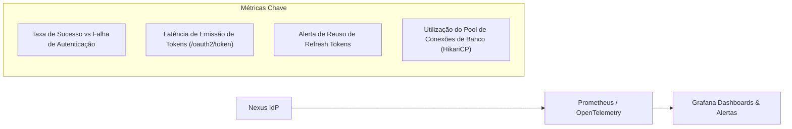

# Operações — Observabilidade e Monitoramento

Este documento define os padrões de monitoramento, sondas de saúde (health checks), métricas de desempenho e rastreamento distribuído para o **Nexus**.

---

## 1. Estado Atual e Dependências Planejadas

- **Estado Atual**: A dependência de monitoramento do Spring Boot (`spring-boot-starter-actuator`) **não está presente no `pom.xml` atual** (`[Planejado]`).
- **Adoção Recomendada**: Adicionar o Actuator e o Micrometer Prometheus Registry para permitir a extração de métricas operacionais.

---

## 2. Sondas de Integridade (Health Checks e Probes)

Para integração adequada com orquestradores (Kubernetes, ECS), o Nexus deve expor:

| Endpoint | Finalidade | Critério de Sucesso |
| :--- | :--- | :--- |
| `/actuator/health/liveness` | Verifica se a aplicação está viva e respondendo. | Processo JVM em execução; HTTP 200. |
| `/actuator/health/readiness` | Verifica se o serviço está pronto para receber tráfego. | Conexão com o banco de dados PostgreSQL ativa; Chaves JWK carregadas em memória; HTTP 200. |

---

## 3. Métricas Críticas de Segurança e Performance

Com o Actuator integrado, as seguintes métricas de negócio e infraestrutura devem ser monitoradas:

1. **Taxa de Erro de Login**: Um pico súbito de respostas 401/403 indica possível ataque de força bruta ou credential stuffing.
2. **Latência de Hashing**: Acompanhar o tempo de resposta das rotinas de cálculo criptográfico de senhas.
3. **Erros 5xx**: Falhas internas na validação ou persistência de tokens.

---

## 4. Endurecimento de Segurança dos Endpoints de Diagnóstico

> [!WARNING]
> Endpoints do Actuator como `/actuator/env`, `/actuator/heapdump`, `/actuator/beans` e `/actuator/configprops` expõem detalhes internos severos da aplicação e **nunca devem ser expostos na internet pública**.

- O endpoint `/actuator/**` deve operar em uma porta de gerenciamento isolada (`management.server.port=9090`) ou ser restrito estritamente a redes internas via firewall e ingress.
- O endpoint `/actuator/health` deve retornar apenas status sintético (`UP`/`DOWN`) para usuários não autenticados (`management.endpoint.health.show-details=never`).
