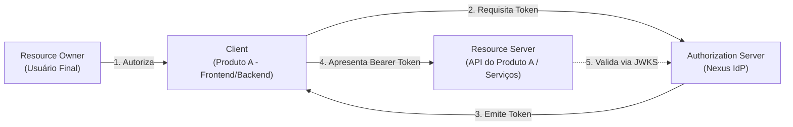
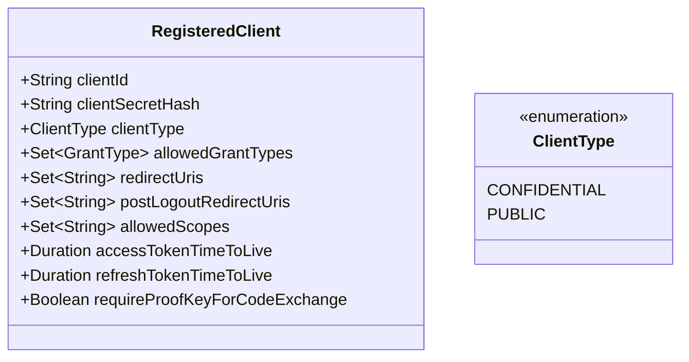

# Protocolos — OAuth 2.0

Este documento define a implementação e as diretrizes do protocolo **OAuth 2.0** no **Nexus**, especificando papéis, tipos de concessão permitidos, proibidos e regras para registro de clientes.

---

## 1. Papéis OAuth 2.0 no Ecossistema

| Papel OAuth 2.0 | Ator no Ecossistema | Descrição |
| :--- | :--- | :--- |
| **Resource Owner** | Usuário humano | Entidade detentora dos dados e identidade. |
| **Client** | Produto Consumidor | Aplicação (SPA, Mobile ou Backend) que solicita acesso à identidade. |
| **Authorization Server** | **Nexus** | Servidor que emite tokens após autenticar o Resource Owner. |
| **Resource Server** | APIs dos Produtos | Serviços que protegem recursos e validam os Access Tokens recebidos. |

---

## 2. Tipos de Concessão (Grant Types)

### 2.1. Concessões Permitidas / Adotadas `[Decisão Adotada]`

1. **Authorization Code Flow com PKCE (RFC 7636)**:
   - **Mandatório** para todas as aplicações com interface de usuário (Web SPAs como React/Vue/Angular, Aplicações Mobile iOS/Android, e Web Apps tradicionais Server-Side).
   - O uso de `code_challenge` (usando obrigatoriamente o método `S256`) e `code_verifier` protege contra interceptação de código em clientes públicos.
2. **Client Credentials Flow (RFC 6749 Seção 4.4)**:
   - Utilizado exclusivamente para **comunicação máquina-para-máquina (M2M)** entre serviços de backend confiáveis sem envolvimento de um usuário final.
3. **Refresh Token Flow (RFC 6749 Seção 6)**:
   - Utilizado para renovação silenciosa de Access Tokens expirados sem exigir nova intervenção do usuário.

### 2.2. Concessões Depreciadas / Expressamente Proibidas

| Concessão | Status | Motivo do Bloqueio |
| :--- | :---: | :--- |
| **Resource Owner Password Credentials (ROPC)** | ❌ Proibido | Obriga o cliente a manipular a senha do usuário, violando o princípio de isolamento de credenciais. Removido no rascunho do OAuth 2.1. |
| **Implicit Flow (`response_type=token`)** | ❌ Proibido | Retorna tokens no fragmento da URL (`#access_token=...`), expondo-os a logs de histórico e scripts maliciosos. Substituído por Auth Code + PKCE. |

---

## 3. Registro e Modelagem de Clientes (Client Registration)

Para que um produto ou serviço interaja com o Nexus, ele deve possuir um registro prévio com os seguintes atributos:

### Tipos de Clientes:
- **Confidential Clients**: Aplicações com backend seguro capazes de guardar um `client_secret` sem expô-lo a terceiros (ex: Spring Boot, Node.js rodando em servidor). Autenticam-se via `client_secret_basic` ou `client_secret_post`.
- **Public Clients**: Aplicações executadas em dispositivos de usuário final (SPAs no browser, apps mobile). **Nunca devem receber um `client_secret`**. Devem obrigatoriamente operar com PKCE (`requireProofKeyForCodeExchange = true`).

### Validação Rígida de Redirecionamento:
- O Nexus **rejeita** wildcards genéricos em `redirect_uris` (ex: `https://*.meudominio.com`).
- Apenas URLs exatas e previamente aprovadas são permitidas para evitar ataques de redirecionamento aberto (Open Redirector).
- Ambientes locais de desenvolvimento só podem utilizar `http://localhost` ou `http://127.0.0.1` com portas estritamente controladas.
