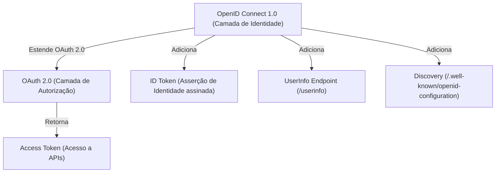

# Protocolos — OpenID Connect (OIDC)

Este documento especifica a camada de identidade **OpenID Connect 1.0 (Core)** implementada pelo **Nexus**, cobrindo discovery, endpoints padronizados, estrutura do ID Token e regras de validação para produtos consumidores.

---

## 1. OIDC como Extensão de Identidade do OAuth 2.0

Enquanto o OAuth 2.0 gerencia *autorização* (concessão de tokens), o OpenID Connect adiciona a camada de *identidade*:



---

## 2. Endpoints Padronizados de OIDC no Nexus

| Endpoint | Método | Descrição |
| :--- | :---: | :--- |
| `/.well-known/openid-configuration` | `GET` | Documento de descoberta de metadados do IdP (URLs de autorização, emissor, chaves, escopos suportados). |
| `/.well-known/jwks.json` | `GET` | Conjunto público de chaves criptográficas (JWKS) usadas para assinar tokens. |
| `/oauth2/authorize` | `GET` | Endpoint interativo de autorização e login. |
| `/oauth2/token` | `POST` | Endpoint de emissão e troca de tokens. |
| `/userinfo` | `GET` / `POST` | Endpoint protegido que retorna os claims de perfil do usuário mediante apresentação de um Access Token válido. |
| `/connect/logout` | `GET` / `POST` | Endpoint de encerramento de sessão (RP-Initiated Logout). |

---

## 3. Estrutura do ID Token

O ID Token é um **JSON Web Token (JWT)** assinado pelo Nexus com chave assimétrica privada (algoritmo padrão: `RS256` ou `ES256`).

### Exemplo de Payload do ID Token:
```json
{
  "iss": "https://auth.nexus.internal",
  "sub": "9b1deb4d-3b7d-4bad-9bdd-2b0d7b3dcb6d",
  "aud": "product-a-client-id",
  "exp": 1790683200,
  "nbf": 1790679600,
  "iat": 1790679600,
  "auth_time": 1790679590,
  "nonce": "n-0S6_WzA2Mj",
  "email": "usuario@exemplo.com",
  "email_verified": true,
  "name": "Matheus Ferreira"
}
```

### Claims Padrão Emitidos:
- `iss` (Issuer): URL canônica do emissor Nexus. Deve ser idêntica à configurada nos produtos.
- `sub` (Subject): Identificador primário imutável do usuário no Nexus.
- `aud` (Audience): O `client_id` da aplicação que solicitou a autenticação.
- `exp` (Expiration Time): Momento em que o token deixa de ser aceito.
- `iat` (Issued At): Momento da emissão do token.
- `nonce`: Valor criptográfico fornecido pelo cliente na autorização para mitigar ataques de repetição (Replay Attacks).

---

## 4. Guia de Validação do ID Token para Produtos Consumidores

Qualquer aplicação ou microsserviço consumidor que receba um token do Nexus **deve** executar as seguintes validações locais antes de aceitar a identidade:

1. **Obter Chaves Públicas**: Consumir o endpoint `/.well-known/jwks.json` e aplicar cache com política de atualização e TTL adequado.
2. **Validar Assinatura**: Verificar se a assinatura corresponde à chave pública indicada pelo cabeçalho `kid` (Key ID) do JWT.
3. **Validar o Emissor (`iss`)**: Rejeitar o token caso `iss` não seja exatamente a URL canônica do Nexus.
4. **Validar o Público (`aud`)**: Confirmar se o claim `aud` contém o identificador registrado do produto (`client_id`).
5. **Validar Temporalidade (`exp`, `nbf`)**: Rejeitar tokens expirados (`exp < now`) ou que ainda não sejam válidos (`nbf > now`), permitindo uma tolerância máxima (clock skew) de até 60 segundos.
6. **Validar `nonce`**: Em fluxos interativos de autorização, verificar se o valor retornado no ID Token coincide exatamente com o valor gerado na requisição inicial de login.
