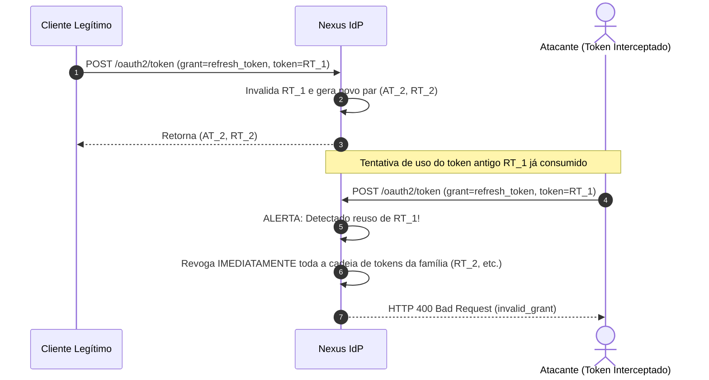

# Protocolos — Tokens e Gestão Criptográfica

Este documento especifica os tipos de tokens emitidos pelo **Nexus**, suas características técnicas, tempo de vida, mecânicas de rotação e a gestão de chaves criptográficas assimétricas.

---

## 1. Tipologia de Tokens

| Atributo | Access Token | Refresh Token | ID Token |
| :--- | :--- | :--- | :--- |
| **Padrão** | RFC 9068 (JWT Profile) ou Opaque | RFC 6749 / String opaca | OpenID Connect Core 1.0 (JWT) |
| **Formato Adotado** | JWT Assinado (`[Decisão Adotada]`) | String Criptografada / Hash | JWT Assinado (`[Decisão Adotada]`) |
| **Destinatário** | Resource Servers (APIs de Produtos) | Authorization Server (Nexus) | Client Application (Frontend / Backend) |
| **Finalidade** | Autorizar requisições HTTP a APIs | Obter novos Access Tokens | Provar autenticação e fornecer claims |
| **Tempo de Vida (TTL)** | Curto (5 a 15 minutos) | Longo (1 a 14 dias) | Curto (15 a 60 minutos) |
| **Validação** | Offline via JWKS pública | Online no banco do Nexus | Offline via JWKS pública |

---

## 2. Refresh Token Rotation (RTR) e Detecção de Reuso

Para mitigar o risco de vazamento de credenciais de longa duração, o Nexus adota a política de **Refresh Token Rotation (RTR)** com **detecção automática de reuso**:



### Regras de Rotação:
1. Cada vez que um Refresh Token é consumido, ele é **invalidado permanentemente**.
2. Um novo Refresh Token é emitido em substituição.
3. Se um Refresh Token previamente invalidado for reapresentado ao Nexus, o sistema assume que o token foi interceptado por um invasor, **invalidando imediatamente todos os tokens descendentes** daquela cadeia de sessão.

---

## 3. Gestão de Chaves Criptográficas (JWKS e Key Rotation)

### 3.1. Algoritmo Criptográfico
- **Algoritmo Adotado**: **RS256** (RSA Signature com SHA-256 e chaves de no mínimo 2048 bits) ou **ES256** (ECDSA utilizando curva P-256 e SHA-256).
- *Status*: `[Questão Aberta]` entre RS256 (compatibilidade universal) e ES256 (maior performance e chaves menores).

### 3.2. Chave Privada vs Chave Pública
- A **chave privada** de assinatura reside exclusivamente na memória segura do Nexus ou em um KMS (Key Management Service). **Nunca é exposta em endpoints ou logs**.
- A **chave pública** é exposta publicamente no endpoint `/.well-known/jwks.json`:
  ```json
  {
    "keys": [
      {
        "kty": "RSA",
        "e": "AQAB",
        "use": "sig",
        "kid": "nexus-key-2026a",
        "alg": "RS256",
        "n": "u1W_c... (módulo público da chave)"
      }
    ]
  }
  ```

### 3.3. Ciclo de Rotação de Chaves (Zero-Downtime Key Rotation)
1. **Geração**: Uma nova chave (ex: `kid=nexus-key-2026b`) é gerada e adicionada ao JWKS público paralelamente à chave ativa.
2. **Período de Graça (Grace Period)**: Clientes atualizam seu cache de JWKS. A chave antiga continua assinando novos tokens ou apenas validando os já emitidos.
3. **Virada (Promotion)**: A nova chave passa a assinar todos os novos tokens emitidos.
4. **Descarte (Decommission)**: Após expirar a vida máxima de qualquer token assinado pela chave antiga, a chave anterior é removida do JWKS.

---

## 4. Revogação e Introspecção de Tokens

- **Revogação (RFC 7009)**: Endpoint `/oauth2/revoke` permitindo que clientes solicitem o cancelamento explícito de um token (Access Token ou Refresh Token).
- **Introspecção (RFC 7662)**: Endpoint `/oauth2/introspect` restrito a Resource Servers autorizados para consulta do estado e validade de tokens em tempo real.
