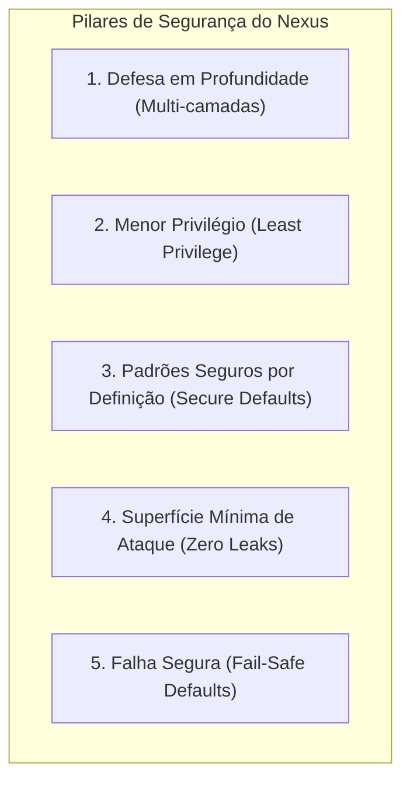

# Segurança — Modelo Geral de Segurança

Este documento define a filosofia de segurança, os postulados de proteção e os princípios operacionais aplicados ao **Nexus** como componente crítico de infraestrutura.

---

## 1. Princípios de Segurança

1. **Defesa em Profundidade**: Múltiplas camadas independentes de validação (rede, filtros HTTP, validação criptográfica, rate limiting, lógica de serviço).
2. **Menor Privilégio**: Cada cliente OAuth2 só recebe escopos explicitamente autorizados. Cada usuário possui acesso apenas à sua própria identidade.
3. **Padrões Seguros por Definição**: Nenhuma configuração vem aberta por comodidade. Cookies são seguros, HTTPS é compulsório, tokens possuem tempos de vida curtos.
4. **Superfície Mínima de Ataque**: Sem bibliotecas desnecessárias no classpath, sem exposição de endpoints internos ou detalhes de erros em respostas HTTP.
5. **Falha Segura**: Em caso de falha em validações, o acesso é sumariamente negado por padrão.

---

## 2. Diferença Estrutural: Autenticação vs Autorização

A confusão entre autenticação e autorização é uma das maiores causas de vulnerabilidades de controle de acesso (BOLA/BFLA). No Nexus:

| Conceito | Pergunta Respondida | Entidade Responsável | Evidência no Sistema |
| :--- | :--- | :--- | :--- |
| **Autenticação (AuthN)** | *"Quem é você?"* | **Nexus IdP** | ID Token assinado, credencial verificada, sessão de SSO. |
| **Autorização de Identidade** | *"O cliente pode ler este dado cadastral?"* | **Nexus IdP** | Consentimento de escopos (`email`, `profile`). |
| **Autorização de Negócio (AuthZ)** | *"Você pode executar esta ação de domínio?"* | **Produto Consumidor** | Regras de RBAC/ABAC locais nos microsserviços do produto. |

---

## 3. Matriz de Controles de Segurança

| Domínio de Segurança | Controle | Classificação | Status Atual |
| :--- | :--- | :---: | :---: |
| **Transporte** | Forçar TLS 1.3 / HSTS | `[Obrigatório]` | Infraestrutura de ingress |
| **Credenciais** | Hashing seguro (Argon2id / BCrypt) | `[Obrigatório]` | `[Planejado]` |
| **Sessão** | Cookies `HttpOnly`, `Secure`, `SameSite=Lax` | `[Obrigatório]` | `[Planejado]` |
| **Sessão** | Invalidação e renovação de ID no login (Fixation) | `[Obrigatório]` | Suportado pelo Spring Security |
| **Tokens** | Assinatura assimétrica (RS256 / ES256) | `[Obrigatório]` | `[Decisão Adotada]` |
| **Tokens** | Refresh Token Rotation (RTR) com detecção de reuso | `[Obrigatório]` | `[Decisão Adotada]` |
| **Ataques Web** | Proteção contra CSRF em endpoints de sessão interativa | `[Obrigatório]` | Suportado pelo Spring Security |
| **Ataques Web** | Headers de proteção (CSP, X-Frame-Options: DENY) | `[Obrigatório]` | Suportado pelo Spring Security |
| **Abuso / DoS** | Rate Limiting em `/oauth2/token` e `/login` | `[Obrigatório]` | `[Planejado]` |
| **Auditoria** | Log estruturado de eventos de segurança (sem PII) | `[Obrigatório]` | `[Planejado]` |
