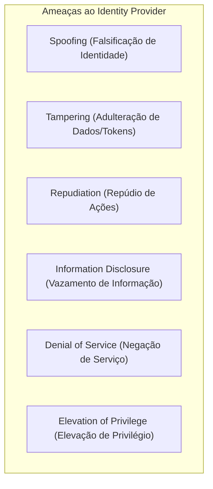

# Segurança — Modelo de Ameaças (Threat Model - STRIDE)

Este documento aplica a metodologia **STRIDE** ao **Nexus**, mapeando vetores de ataque específicos contra um Identity Provider e estabelecendo as contramedidas técnicas obrigatórias.

---

## 1. Mapeamento de Ameaças STRIDE

---

## 2. Análise Detalhada por Categoria

### 2.1. Spoofing (Falsificação de Identidade)
* **Ameaça S1**: Credential Stuffing e ataques de dicionário contra a tela de login.
  - *Mitigação*: Rate limiting por IP e por conta de usuário (`[Planejado]`), bloqueio temporário após tentativas consecutivas inválidas (`[Planejado]`), futuro suporte a MFA (`[Planejado]`).
* **Ameaça S2**: Falsificação de tokens JWT ou aceitação de algoritmo `none`.
  - *Mitigação*: Assinatura estrita com verificação de algoritmo em whitelist (`RS256`/`ES256`). Rejeição automática de `alg: none` ou troca assimétrica por simétrica (`[Obrigatório]`).
* **Ameaça S3**: Interceptação de Authorization Code por aplicações maliciosas no dispositivo.
  - *Mitigação*: Uso obrigatório de PKCE com verificação SHA-256 (`code_challenge_method=S256`) (`[Decisão Adotada]`).

### 2.2. Tampering (Adulteração)
* **Ameaça T1**: Alteração do payload do token JWT em trânsito (ex: alteração de `sub` ou `email`).
  - *Mitigação*: Assinatura criptográfica com chave privada RSA/ECDSA e validação de integridade pelos Resource Servers via JWKS (`[Decisão Adotada]`).
* **Ameaça T2**: Modificação de parâmetros na requisição de autorização (ex: manipulação de `redirect_uri`).
  - *Mitigação*: Validação estrita por casamento exato contra a lista pré-cadastrada de `redirect_uris` do cliente (`[Obrigatório]`).

### 2.3. Repudiation (Repúdio)
* **Ameaça R1**: Usuário ou administrador nega ter realizado alterações de credencial, consentimento ou registro de clientes.
  - *Mitigação*: Trilha de auditoria estruturada e imutável para eventos críticos (logins, alterações de senha, revogações, registros de clientes) contendo timestamp UTC, IP mascarado, User-Agent e identificador do ator (`[Planejado]`).

### 2.4. Information Disclosure (Vazamento de Informações)
* **Ameaça I1**: Enumeração de usuários via respostas de erro na tela de login ou recuperação de senha.
  - *Mitigação*: Respostas com tempo de processamento uniforme e mensagens genéricas: *"Se o e-mail informado existir em nossa base, um link de recuperação será enviado."* (`[Obrigatório]`).
* **Ameaça I2**: Vazamento de tokens via histórico de navegação ou logs de proxy.
  - *Mitigação*: Proibição de tokens em query strings (eliminação do Implicit Flow); envio de tokens exclusivamente em cabeçalhos HTTP `Authorization: Bearer <token>` ou corpo de requisições POST (`[Decisão Adotada]`).
* **Ameaça I3**: Vazamento de credenciais e tokens em logs de aplicação.
  - *Mitigação*: Sanitização e filtros no logger para mascarar senhas, tokens e authorization codes (`[Obrigatório]`).

### 2.5. Denial of Service (Negação de Serviço)
* **Ameaça D1**: Esgotamento de CPU via submissão massiva de requisições de login (exploração do custo computacional do Argon2id / BCrypt).
  - *Mitigação*: Rate limiting em nível de gateway / filtro web antes da execução do algoritmo de hashing (`[Planejado]`).
* **Ameaça D2**: Inundação de geração de tokens ou criação excessiva de sessões.
  - *Mitigação*: Cotas de requisição por cliente OAuth2 e limites de conexões simultâneas (`[Planejado]`).

### 2.6. Elevation of Privilege (Elevação de Privilégio)
* **Ameaça E1**: Cliente não autorizado solicitando escopos elevados ou dados de outros produtos.
  - *Mitigação*: Restrição estrita de escopos permitidos configurada por cliente (`RegisteredClient.allowedScopes`). Rejeição automática de requisições que solicitem escopos não concedidos (`[Obrigatório]`).
* **Ameaça E2**: Escalação de privilégios de identidade para privilégios de domínio.
  - *Mitigação*: Isolamento total de domínio — o Nexus não emite papéis administrativos de produtos consumidores dentro de seus tokens (`[Princípio Invariante]`).
