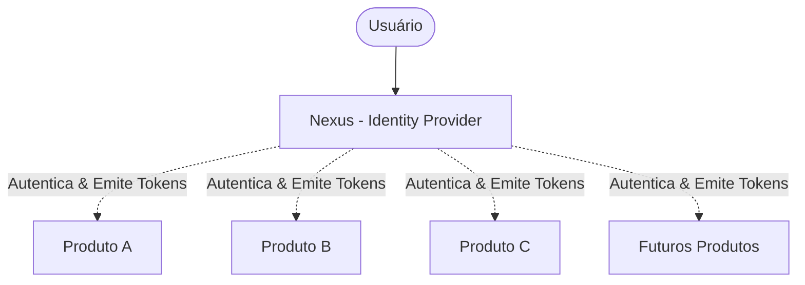

# AGENTS.md — Regras de Operação para Agentes de IA

Este documento define as diretrizes obrigatórias de governança, arquitetura e segurança para **qualquer agente de IA** que atue no repositório **Nexus**.

---

## 1. Contexto do Projeto

O **Nexus** é um **Identity Provider (IdP) centralizado**, concebido para servir como infraestrutura única de identidade e autenticação para uma família de produtos e serviços independentes:

### Invariante Central
- **O Nexus centraliza**: identidade, credenciais, autenticação, sessões de IdP, clientes OAuth2/OIDC, escopos de identidade, claims globais e emissão/revogação de tokens.
- **O Nexus NÃO conhece**: modelos de domínio dos produtos, regras de negócio externas, entidades locais de negócio ou autorizações granulares específicas de cada produto (RBAC/ABAC de domínio).

---

## 2. Taxonomia de Decisões e Honestidade Documental

Todo agente deve classificar e documentar o estado do sistema utilizando **estritamente** a taxonomia abaixo:

| Classificação | Significado | Exemplo no Nexus |
| :--- | :--- | :--- |
| **Implementado** | Código e configuração já presentes e verificáveis no repositório. | Java 21, Spring Boot 4.1.1, Maven Wrapper. |
| **Decisão Adotada** | Decisão arquitetural acordada formalmente, com implementação pendente. | Uso de OAuth 2.0 / OpenID Connect; Desacoplamento de domínio. |
| **Intenção Futura** | Funcionalidade ou capacidade planejada para fases posteriores. | Suporte a Multi-Factor Authentication (MFA), Passkeys/WebAuthn. |
| **Hipótese** | Suposição técnica sob avaliação que precisa de validação empírica. | Driver PostgreSQL em runtime como banco de produção. |
| **Questão Aberta / TBD** | Ponto de decisão pendente sem consenso ou definição final. | Biblioteca OIDC específica (Spring Authorization Server vs alternativa); Ferramenta de migração (Flyway vs Liquibase). |

> [!CAUTION]
> **REGRA FUNDAMENTAL: NÃO INVENTE DECISÕES.**
> Nunca documente ou trate uma biblioteca, infraestrutura ou funcionalidade como existente caso ela não esteja presente no código ou nos arquivos de configuração do repositório.

---

## 3. Regra de Leitura Obrigatória da Documentação

Antes de propor ou implementar alterações arquiteturais ou de segurança, o agente **deve consultar a documentação relevante em [`.docs/`](file:///C:/Users/matheus.ferreira/Documents/Nexus/.docs/README.md)**:

- Alterações em **entidades de usuário ou dados de identidade**: leia [`.docs/identity/identity-model.md`](file:///C:/Users/matheus.ferreira/Documents/Nexus/.docs/identity/identity-model.md).
- Alterações em **fluxos de login, senhas ou credenciais**: leia [`.docs/identity/authentication.md`](file:///C:/Users/matheus.ferreira/Documents/Nexus/.docs/identity/authentication.md) e [`.docs/security/`](file:///C:/Users/matheus.ferreira/Documents/Nexus/.docs/security/security-model.md).
- Alterações em **tokens, grants ou endpoints OAuth2/OIDC**: leia [`.docs/protocols/`](file:///C:/Users/matheus.ferreira/Documents/Nexus/.docs/protocols/tokens.md).
- Alterações em **dependências, builds ou padrões de código**: leia [`.docs/development/`](file:///C:/Users/matheus.ferreira/Documents/Nexus/.docs/development/conventions.md) e [`.docs/decisions/`](file:///C:/Users/matheus.ferreira/Documents/Nexus/.docs/decisions/README.md).
- Alterações em **configuração de runtime ou infraestrutura**: leia [`.docs/operations/`](file:///C:/Users/matheus.ferreira/Documents/Nexus/.docs/operations/configuration.md).

---

## 4. Regras para Alteração de Código

Ao receber uma tarefa de código, o agente deve seguir rigorosamente este fluxo:

1. **Inspecionar o código existente**: verificar classes, testes e propriedades reais.
2. **Consultar a documentação correspondente**: entender as restrições arquiteturais existentes.
3. **Identificar decisões afetadas**: avaliar se a alteração introduz ou altera uma decisão técnica.
4. **Preservar invariantes**:
   - Manter independência total entre Nexus e regras de negócio externas.
   - Preservar integridade de contratos públicos (OpenID Connect / OAuth 2.0).
5. **Evitar escopo não solicitado**: não adicionar bibliotecas, refatorações amplas ou classes auxiliares que não tenham sido expressamente demandadas ou estritamente necessárias.
6. **Atualizar documentação viva**: se a alteração mudar contratos, propriedades, fluxos ou decisões, o agente **deve atualizar os arquivos correspondentes em [`.docs/`](file:///C:/Users/matheus.ferreira/Documents/Nexus/.docs/)** no mesmo ciclo de trabalho.

---

## 5. Diretrizes Rígidas de Segurança (IdP Core)

O Nexus é infraestrutura crítica de segurança. Todo agente deve seguir estas regras sem exceção:

1. **Zero Secrets no Código**:
   - Nunca cometer chaves privadas, senhas, tokens, client secrets ou certificados em arquivos do repositório ou exemplos de teste commitados.
   - Configurações sensíveis devem ser injetadas via variáveis de ambiente ou secret stores.
2. **Sem Vazamento de Credenciais ou Tokens**:
   - Proibido logar senhas (claras ou hasheadas), tokens de acesso, refresh tokens, authorization codes ou segredos de clientes em qualquer nível de log (`DEBUG`, `INFO`, `ERROR`).
   - Respostas de erro HTTP (ex: RFC 7807/9457) nunca devem expor stack traces, detalhes de banco ou motivos detalhados de falha de login (evitar enumeração de usuários).
3. **Criptografia Padrão e Reconhecida**:
   - Nunca invente algoritmos de hashing, esquemas de assinatura ou cifras proprietárias.
   - Utilize implementações padronizadas (ex: BCrypt / Argon2id para senhas, RSA / ECDSA para assinatura de JWTs).
4. **Sem Desativação de Proteções por Conveniência**:
   - Jamais desabilite CSRF, CORS, validação de certificados TLS ou restrições de redirecionamento (`redirect_uri`) para contornar problemas locais de desenvolvimento.
5. **Tokens e Sessões Críticos**:
   - Access tokens devem ter tempo de vida curto.
   - Refresh tokens exigem mecanismo de rotação (Refresh Token Rotation - RTR) e revogação.
   - Authorization Code Flow deve exigir **PKCE** (RFC 7636).

---

## 6. Princípio de Mínimo Acoplamento

- **Nexus para Produtos**: O Nexus expõe apenas endpoints padrão (OAuth2, OIDC, SCIM ou APIs de identidade). O Nexus **nunca importa dependências, DTOs ou entidades de produtos consumidores**.
- **Produtos para Nexus**: Os produtos tratam o Nexus como um emissor confiável de identidade (Identity Provider / Token Issuer), validando tokens via JWKS (`/.well-known/jwks.json`).

---

## 7. Princípio de Simplicidade e Idiomaticidade

- Preferir soluções simples, explícitas e idiomáticas do Spring Boot e Java 21 moderno.
- Evitar frameworks adicionais ou camadas de abstração especulativas antes que surja uma necessidade concreta.
- Aproveitar recursos modernos da plataforma Java (records, sealed interfaces, pattern matching) antes de criar estruturas complexas de classes.

---

## 8. Preservação de Contexto e Histórico

- Não apague explicações conceituais ou decisões anteriores sob a justificativa de concisão.
- Antes de alterar um documento, diferencie se o texto descreve:
  - um registro histórico (imutável na essência, como um ADR aceito);
  - a especificação do estado atual;
  - ou uma proposta que foi substituída.
- Ao substituir uma decisão técnica, registre a superação formalmente via ADR (Architecture Decision Record) em [`.docs/decisions/`](file:///C:/Users/matheus.ferreira/Documents/Nexus/.docs/decisions/).
