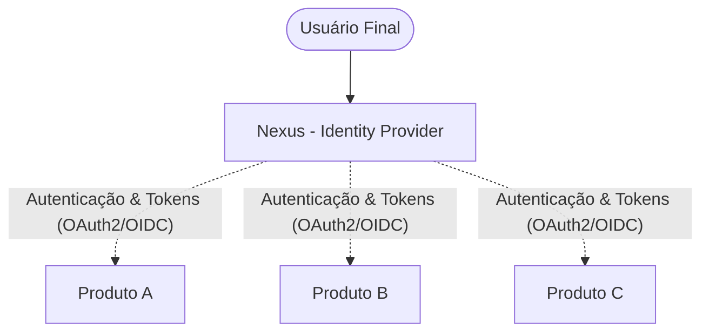
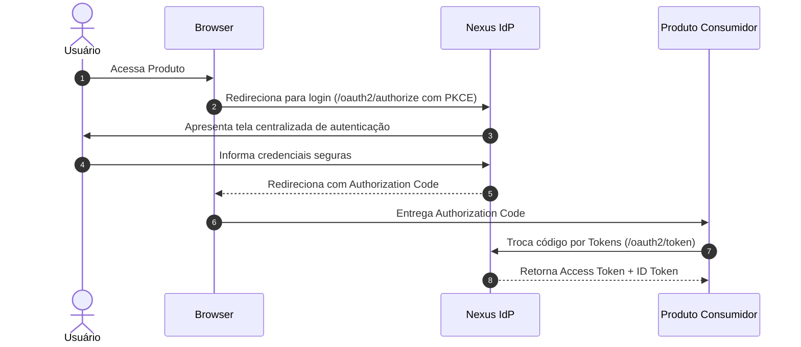

# Nexus

> **Identity Provider (IdP) centralizado e desacoplado para ecossistemas de produtos independentes.**

---

## 1. Overview

O **Nexus** é uma autoridade centralizada de identidade projetada para unificar autenticação, credenciais e gerenciamento de sessões para uma família de produtos e serviços autônomos.

Em vez de cada produto manter seu próprio banco de usuários, fluxos de login e mecânicas de redefinição de senha, o Nexus centraliza toda a infraestrutura de identidade. Cada aplicação consumidora delega a autenticação ao Nexus e concentra-se exclusivamente em suas regras de negócio e permissões de domínio.



---

## 2. Goals

- **Autenticação Única (Single Sign-On - SSO)**: Permitir que uma única credencial acesse múltiplos produtos do ecossistema de forma transparente.
- **Desacoplamento Estrito**: Isolar a gestão de identidades e credenciais das lógicas comerciais dos produtos.
- **Padrões Abertos da Indústria**: Prover suporte nativo aos protocolos **OAuth 2.0** e **OpenID Connect (OIDC 1.0)**.
- **Segurança Estrutural**: Garantir proteção contra enumeração, força bruta, vazamento de credenciais e ataques comuns a tokens.

---

## 3. Architecture Overview

O Nexus atua como um **Authorization Server** e **OpenID Connect Provider**. Ele conhece identidades, sessões, clientes e emite tokens assinados criptograficamente.

A comunicação entre o usuário, o Nexus e os produtos segue o fluxo padrão de mercado:



Para uma análise aprofundada dos limites e responsabilidades, consulte:
- [Visão Geral da Arquitetura](.docs/architecture/overview.md)
- [Princípios Arquiteturais](.docs/architecture/principles.md)
- [Fronteiras e Responsabilidades (Nexus vs Produtos)](.docs/architecture/boundaries.md)

---

## 4. Technology Stack

A pilha tecnológica atual reflete **estritamente** os componentes configurados no projeto:

| Componente | Tecnologia | Versão | Função no Projeto |
| :--- | :--- | :---: | :--- |
| **Linguagem** | Java | 21 LTS | Plataforma de desenvolvimento e runtime. |
| **Framework** | Spring Boot | 4.1.1 | Injeção de dependências e sustentação da aplicação. |
| **Build & Packaging** | Apache Maven | 3.9.16 (Wrapper) | Gerenciador de ciclo de vida e compilação. |
| **Web MVC** | Spring WebMVC | 4.1.1 | Camada HTTP baseada em Servlets síncronos. |
| **Segurança** | Spring Security | 4.1.1 | Cadeia de filtros e infraestrutura básica de segurança. |
| **Persistência** | Spring Data JPA | 4.1.1 | Abstração de repositórios e entidades relacionais. |
| **Banco de Dados** | PostgreSQL JDBC Driver | Runtime | Driver para comunicação com o banco de dados. |
| **Produtividade** | Project Lombok | Opcional | Geração automatizada de getters, construtores e builders. |
| **Testes** | JUnit 5 + Starters Modulares | Test scope | Validação automatizada e testes de contexto. |

*Para mais detalhes sobre as justificativas dessas escolhas, consulte o [ADR-0001: Bootstrap Tecnológico Inicial](.docs/decisions/0001-initial-tech-stack-bootstrap.md).*

---

## 5. Project Structure

```
Nexus/
├── .mvn/wrapper/                  # Maven Wrapper
├── src/
│   ├── main/
│   │   ├── java/io/github/theprogmatheus/nexus/
│   │   │   └── NexusApplication.java   # Ponto de entrada da aplicação
│   │   └── resources/
│   │       └── application.properties # Propriedades do Spring Boot
│   └── test/
│       └── java/io/github/theprogmatheus/nexus/
│           └── NexusApplicationTests.java # Testes de contexto
├── .docs/                         # Base de conhecimento e documentação arquitetural
├── AGENTS.md                      # Regras de operação para agentes de IA
├── pom.xml                        # Dependências e plugins do Maven
└── README.md                      # Este documento
```

---

## 6. Getting Started

### Pré-requisitos
- **Java 21 JDK** instalado e configurado no `PATH` (`JAVA_HOME`).
- Git para clonagem do repositório.

### Compilando o Projeto
Utilize o Maven Wrapper embutido no projeto:

```bash
# Em ambiente Linux/macOS
./mvnw clean compile

# Em ambiente Windows (PowerShell / CMD)
.\mvnw.cmd clean compile
```

---

## 7. Configuration

As configurações do projeto encontram-se em [`src/main/resources/application.properties`](src/main/resources/application.properties).

Nenhum segredo ou credencial deve ser versionado no código. Todas as propriedades dinâmicas suportam sobreposição por variáveis de ambiente:

```bash
export SERVER_PORT=8080
export SPRING_DATASOURCE_URL=jdbc:postgresql://localhost:5432/nexus_db
export SPRING_DATASOURCE_USERNAME=nexus
export SPRING_DATASOURCE_PASSWORD=sua_senha_segura
```

Para a matriz completa de parâmetros suportados e perfis, leia o [Guia de Configuração](.docs/operations/configuration.md).

---

## 8. Running Locally

Para iniciar a aplicação:

```bash
./mvnw spring-boot:run
```

> [!NOTE]
> Como o projeto inclui `spring-boot-starter-data-jpa` e o driver do PostgreSQL, a inicialização completa do servidor requer um banco PostgreSQL acessível via propriedades ou variáveis de ambiente. Para detalhes e soluções de contorno locais, consulte o [Guia de Troubleshooting](.docs/development/troubleshooting.md).

---

## 9. Testing

Para executar a suíte automatizada de testes:

```bash
./mvnw test
```

Para mais detalhes sobre slice tests (`@DataJpaTest`, `@WebMvcTest`) e testes de segurança, veja o [Guia de Testes](.docs/development/testing.md).

---

## 10. Documentation Index

A documentação detalhada reside no diretório [`.docs/`](.docs/README.md):

- **Arquitetura**: [Visão Geral](.docs/architecture/overview.md) | [Princípios](.docs/architecture/principles.md) | [Fronteiras](.docs/architecture/boundaries.md) | [Registro de Decisões](.docs/architecture/decisions.md)
- **Identidade**: [Modelo de Usuário](.docs/identity/identity-model.md) | [Autenticação e Senhas](.docs/identity/authentication.md) | [Autorização e Escopos](.docs/identity/authorization.md) | [Sessões e Logout](.docs/identity/sessions.md)
- **Protocolos**: [OAuth 2.0](.docs/protocols/oauth2.md) | [OpenID Connect](.docs/protocols/openid-connect.md) | [Tokens e Chaves JWK](.docs/protocols/tokens.md)
- **Segurança**: [Modelo de Segurança](.docs/security/security-model.md) | [Modelo de Ameaças (STRIDE)](.docs/security/threat-model.md) | [Gestão de Segredos](.docs/security/secrets.md) | [Auditoria e Logging](.docs/security/logging.md) | [Checklist](.docs/security/security-checklist.md)
- **Desenvolvimento & Operações**: [Setup](.docs/development/setup.md) | [Estrutura](.docs/development/project-structure.md) | [Convenções](.docs/development/conventions.md) | [Troubleshooting](.docs/development/troubleshooting.md) | [Deploy](.docs/operations/deployment.md) | [Observabilidade](.docs/operations/observability.md) | [Backup & DR](.docs/operations/backup-and-recovery.md)
- **Decisões (ADRs)**: [Índice de ADRs](.docs/decisions/README.md) | [Template](.docs/decisions/template.md) | [ADR-0001](.docs/decisions/0001-initial-tech-stack-bootstrap.md) | [ADR-0002](.docs/decisions/0002-spring-authorization-server-adoption.md) | [ADR-0003](.docs/decisions/0003-server-side-rendering-thymeleaf.md)

---

## 11. Development Guidelines

Instruções mandatórias para **Agentes de IA** e desenvolvedores estão centralizadas no arquivo [AGENTS.md](AGENTS.md).
- Respeite as invariantes de isolamento de domínio.
- Nunca adicione código ou dependências de regras de produtos dentro do Nexus.
- Mantenha a documentação sincronizada a cada nova alteração de código.

---

## 12. Security

O Nexus é um componente crítico de infraestrutura de autenticação.
- Nunca cometa senhas, chaves privadas ou tokens no repositório.
- Não desabilite proteções padrão do Spring Security (CSRF, CORS, HSTS).
- Consulte o [Modelo de Segurança](.docs/security/security-model.md) e o [Checklist de Segurança](.docs/security/security-checklist.md) antes de submeter alterações.

---

## 13. Project Status

| Dimensão | Estado Atual |
| :--- | :--- |
| **Fase do Projeto** | **Bootstrap Inicial** (`v0.0.1-SNAPSHOT`) |
| **Estrutura Base** | Criada via Spring Initializr (Java 21, Spring Boot 4.1.1, Maven) |
| **Camada de Identidade** | Especificada conceitualmente; entidades e serviços pendentes de implementação |
| **Camada OAuth2/OIDC** | Aprovada formalmente via Spring Authorization Server ([ADR-0002](.docs/decisions/0002-spring-authorization-server-adoption.md)) |
| **Camada de Apresentação** | Aprovada formalmente via Thymeleaf SSR ([ADR-0003](.docs/decisions/0003-server-side-rendering-thymeleaf.md)) |

---

## 14. Roadmap & Decisões Pendentes (Open Questions)

- [x] **ADR do Servidor de Autorização**: Formalizada a adoção do Spring Authorization Server ([ADR-0002](.docs/decisions/0002-spring-authorization-server-adoption.md)).
- [x] **ADR da Camada de Apresentação (UI)**: Formalizada a adoção de Thymeleaf SSR ([ADR-0003](.docs/decisions/0003-server-side-rendering-thymeleaf.md)).
- [ ] **Inclusão de Dependências no `pom.xml`**: Adicionar `spring-security-oauth2-authorization-server` e `spring-boot-starter-thymeleaf`.
- [ ] **Ferramenta de Migração de Banco**: Definir entre Flyway e Liquibase para versionamento de schema.
- [ ] **Esquema de Senhas**: Homologar `Argon2id` como encoder padrão do Spring Security.
- [ ] **Implementação das Entidades de Identidade**: Criar `NexusUser` e repositórios JPA.
- [ ] **Multi-Factor Authentication (MFA)**: Suporte planejado a TOTP (RFC 6238) e Passkeys na Fase 2.
